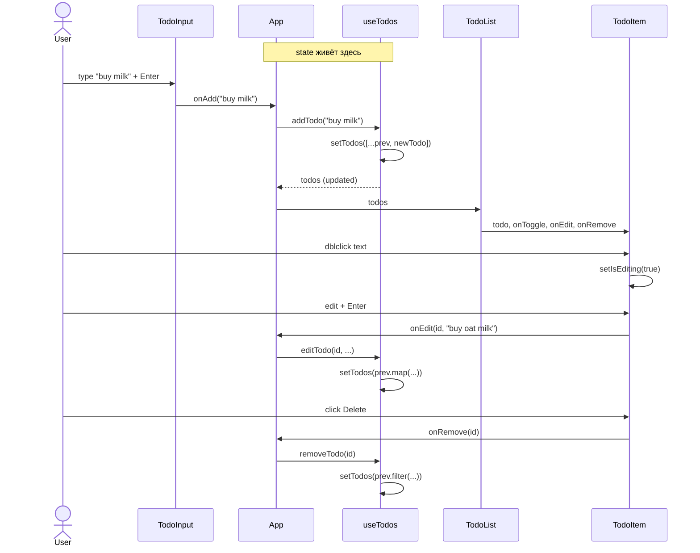

# Codebase Map

> Auto-generated by Cartographer. Last mapped: 2026-05-11T09:36:46Z

## System Overview

Учебный SPA на React + TypeScript: in-memory todo-приложение, реализуемое последовательно через Jira-тикеты SCRUM-5..9 как полигон 8-шагового AI workflow Vention. Без backend, без сети, без персистентности (SCRUM-8 на подходе).

```mermaid
graph TB
    User[👤 User]
    subgraph Browser
        Index[index.html]
        Main[main.tsx]
        App[App.tsx]
        subgraph State
            UseTodos[useTodos hook<br/>useState&lt;Todo[]&gt;]
        end
        subgraph Components
            TodoInput[TodoInput]
            TodoList[TodoList]
            TodoItem[TodoItem]
        end
        TailwindCSS[Tailwind CSS<br/>via index.css]
    end
    subgraph Build
        Vite[Vite 8]
        TSC[tsc -b]
        Vitest[Vitest 2 + RTL + jsdom]
        ESLint[ESLint v10 flat]
        Prettier[Prettier 3]
    end
    User --> Index
    Index --> Main
    Main --> App
    App --> UseTodos
    App --> TodoInput
    App --> TodoList
    TodoList --> TodoItem
    TodoInput -.callbacks.-> UseTodos
    TodoItem -.callbacks.-> UseTodos
    App --> TailwindCSS
```

## Stack

| Tool | Version | Note |
|---|---|---|
| React | ^19.2.6 | React 19 (DOM client + StrictMode) |
| TypeScript | ~6.0.2 | strict + `verbatimModuleSyntax` + `erasableSyntaxOnly` |
| Vite | ^8.0.12 | `@vitejs/plugin-react` ^6.0.1 |
| Tailwind CSS | ^3.4.17 | v3 принудительно (npm-default = v4, ломающий конфиг) |
| ESLint | ^10.3.0 | flat config через `eslint/config` |
| typescript-eslint | ^8.59.2 | + `eslint-plugin-react-hooks` ^7.1.1 + `react-refresh` ^0.5.2 |
| Prettier | ^3.4.2 | + `eslint-config-prettier` ^9.1.0 (отключает конфликтующие правила) |
| Vitest | ^2.1.8 | + `@vitest/coverage-v8`, environment `jsdom` ^25.0.1 |
| React Testing Library | ^16.1.0 | + `@testing-library/jest-dom` ^6.6.3 + `user-event` ^14.5.2 |
| PostCSS | ^8.4.49 | + `autoprefixer` ^10.4.20 |

## Directory Structure

```
claudetest/
├── index.html                       # SPA entry, монтирует <div id="root">
├── package.json                     # манифест + npm scripts
├── package-lock.json                # lockfile
├── vite.config.ts                   # минимальный Vite (только @vitejs/plugin-react)
├── vitest.config.ts                 # mergeConfig поверх vite.config + jsdom
├── tsconfig.json                    # root: files=[], references → app + node
├── tsconfig.app.json                # TS для src/ (ES2023, noEmit, strict-плюшки)
├── tsconfig.node.json               # TS для tooling-конфигов (vite/vitest/tailwind/postcss)
├── tailwind.config.ts               # content: index.html + src/**/*.{ts,tsx}
├── postcss.config.js                # plugins: tailwindcss + autoprefixer
├── eslint.config.js                 # flat: js + ts + react-hooks + react-refresh + prettier
├── .prettierrc                      # singleQuote, semi, trailingComma:all, printWidth:100
├── .prettierignore                  # dist, node_modules, coverage, docs/, AI-файлы
├── .gitignore                       # стандартный + .vite + coverage
├── README.md                        # описание + npm-команды + статус тикетов
├── AI_WORKFLOW_PLAN.md              # план 8 шагов мануала + порядок тикетов + push policy + CI план
├── AI manual for individual exploration.md   # исходник 8-шагового Vention мануала
├── main.txt                         # пустой (legacy)
├── .claude/skills/cartographer/     # установленный Cartographer-скилл (SKILL.md + scripts/)
├── public/
│   └── favicon.svg
├── docs/
│   ├── CODEBASE_MAP.md              # ⬅ этот файл
│   └── specs/
│       └── SCRUM-5.md               # DoR-спека для SCRUM-5 (merged)
└── src/
    ├── main.tsx                     # createRoot + StrictMode + App
    ├── App.tsx                      # корневой компонент, оркестрирует useTodos
    ├── App.test.tsx                 # 1 smoke-тест (заголовок "Todo App")
    ├── setupTests.ts                # подключает @testing-library/jest-dom матчеры
    ├── index.css                    # @tailwind base/components/utilities
    ├── types/
    │   └── todo.ts                  # interface Todo
    ├── hooks/
    │   └── useTodos.ts              # state + 4 useCallback-действия
    └── components/
        ├── TodoInput.tsx            # form + controlled input
        ├── TodoList.tsx             # <ul> или empty state
        └── TodoItem.tsx             # checkbox + inline-edit + delete
```

## Module Guide

### `src/types/`

**Purpose:** Domain types — единственный источник правды для формы данных.

| File | Purpose | Tokens |
|---|---|---|
| `todo.ts` | `interface Todo { id; title; completed; createdAt }` | 25 |

**Exports:** `Todo`
**Dependencies:** —
**Dependents:** `useTodos.ts`, `TodoItem.tsx`, `TodoList.tsx`

### `src/hooks/`

**Purpose:** Бизнес-логика управления списком. Готовит почву для SCRUM-6 (фильтр) и SCRUM-8 (localStorage).

| File | Purpose | Tokens |
|---|---|---|
| `useTodos.ts` | `useState<Todo[]>` + 4 `useCallback`-действия | 351 |

**Exports:** `useTodos(initial?: Todo[]): UseTodosApi`, `UseTodosApi`
**Actions:**
- `addTodo(title)` — trim, guard на пустоту, `crypto.randomUUID()`, `Date.now()`
- `toggleTodo(id)` — map, инверсия `completed`
- `editTodo(id, title)` — trim, guard, map с заменой `title`
- `removeTodo(id)` — filter
- Все обёрнуты в `useCallback` с пустыми deps + functional updaters → стабильные ссылки.

**Dependencies:** `react` (useState, useCallback), `../types/todo`
**Dependents:** `App.tsx`

### `src/components/`

**Purpose:** Presentational UI. State списка — снаружи, в хуке. Локально хранится только UI-state (input value, edit mode).

| File | Purpose | Tokens |
|---|---|---|
| `TodoInput.tsx` | Form + controlled input для add | 250 |
| `TodoList.tsx` | `<ul>` или empty state | 195 |
| `TodoItem.tsx` | checkbox + inline-edit + delete | 532 |

**Exports:** `TodoInput`, `TodoList`, `TodoItem` (все named).

**TodoInput:**
- Props: `{ onAdd: (title: string) => void }`
- Локальный `value: string`, controlled. На submit: `onAdd(value); setValue('')`.
- A11y: `<label htmlFor="new-todo" className="sr-only">`.

**TodoList:**
- Props: `{ todos; onToggle; onEdit; onRemove }`
- Guard: `todos.length === 0` → `<p>No todos yet</p>`.

**TodoItem:**
- Props: `{ todo; onToggle; onEdit; onRemove }`
- Локально: `isEditing: boolean`, `draft: string`.
- Edit-flow: dblclick на `<span>` → `<input autoFocus>` → Enter/blur = `commit()` (trim + diff guard), Escape = `cancel()` (откат draft).
- A11y: `aria-label` на иконочной кнопке Delete и чекбоксе.

**Dependencies:**
- `TodoInput` ← `react` (`useState`, `import type FormEvent`)
- `TodoList` ← `react`, `import type Todo`, `./TodoItem`
- `TodoItem` ← `react` (`useState`, `import type KeyboardEvent`), `import type Todo`

**Dependents:**
- `TodoInput`, `TodoList` ← `App.tsx`
- `TodoItem` ← `TodoList.tsx`

### Корень `src/`

| File | Purpose | Tokens |
|---|---|---|
| `main.tsx` | `createRoot(...).render(<StrictMode><App /></StrictMode>)` + импорт `./index.css` | 58 |
| `App.tsx` | Деструктурирует `useTodos()`, рендерит `<TodoInput>` + `<TodoList>` | 153 |
| `App.test.tsx` | 1 smoke-тест: рендерит App, проверяет heading «Todo App» | 82 |
| `setupTests.ts` | `import '@testing-library/jest-dom/vitest'` | 10 |
| `index.css` | `@tailwind base/components/utilities` | 15 |

`App` — единственный default-export в проекте. Остальные компоненты — named.

## Data Flow



State владеет ровно один `useTodos()` в `App`. Дети — глупые, только локальный UI-state (`TodoInput.value`, `TodoItem.{isEditing,draft}`). Перезагрузка страницы сбрасывает todo-список — это scope SCRUM-8.

## Build & Test Pipeline

| script | command | purpose |
|---|---|---|
| `dev` | `vite` | dev-сервер с HMR на localhost:5173 |
| `build` | `tsc -b && vite build` | type-check (project references) + production bundle в `dist/` |
| `preview` | `vite preview` | предпросмотр production-сборки |
| `lint` | `eslint . --max-warnings 0` | ESLint, zero-warnings policy |
| `format` | `prettier --write "**/*.{ts,tsx,js,cjs,json,md,css,html}"` | форматирование на запись |
| `format:check` | `prettier --check ...` | проверка форматирования (для CI) |
| `typecheck` | `tsc -b` | только type-check, без сборки |
| `test` | `vitest run` | одноразовый прогон |
| `test:watch` | `vitest` | watch-режим |

**Vitest config (vitest.config.ts):** `mergeConfig(viteConfig, ...)` с `environment: 'jsdom'`, `globals: false`, `setupFiles: ['./src/setupTests.ts']`, `css: false`.

**Текущее покрытие:** один smoke-тест в `App.test.tsx`. Расширение — задача SCRUM-9.

**CI:** не настроен. `.github/workflows/ci.yml` отсутствует, план есть в `AI_WORKFLOW_PLAN.md` §6.2.

## Conventions

**TypeScript strict:**
- `verbatimModuleSyntax: true` — любой type-only импорт ОБЯЗАН использовать `import type { ... }`. Нарушение = compile error.
- `erasableSyntaxOnly: true` — запрет namespace, enum с runtime-кодом.
- `noUnusedLocals` + `noUnusedParameters` + `noFallthroughCasesInSwitch`.
- `allowImportingTsExtensions: true` — можно `import App from './App.tsx'`.

**Naming:**
- Компоненты: PascalCase (файл и функция совпадают).
- Хуки: `use*` (`useTodos`).
- Типы: PascalCase (`Todo`, `UseTodosApi`, `*Props`).
- Props-интерфейсы — локальные, не экспортируются (исключение: `UseTodosApi`).

**Экспорты:** named для всего, кроме `App.tsx` (default). Новые компоненты — named.

**Стили:** только Tailwind utility-классы. `style={{...}}` и кастомные CSS-файлы — нет. Условные классы — через шаблонные строки.

**Commits:** Conventional Commits (`feat(SCRUM-X)`, `fix(SCRUM-X)`, `chore:`, `docs:`, `test:`). Ссылка на Jira в footer (`Refs: ...`). Подробнее — `AI_WORKFLOW_PLAN.md` §6.1.

**Branches:** `feature/SCRUM-X-kebab-summary`, `chore/...`, `fix/...`, `docs/...`. Прямые коммиты в `main` запрещены — только через PR.

## Gotchas

1. **ESLint v10 flat config.** `eslint.config.js` использует `defineConfig`/`globalIgnores` из `eslint/config`. `.eslintrc.cjs`-формат не работает; новые плагины ищем в flat-config совместимости (`configs.flat.*` или новый объектный формат).
2. **Tailwind v3 фиксируется явно.** Без явного `^3.4.17` `npm install tailwindcss` поставит v4 — конфиг и CLI v4 несовместимы.
3. **`tsc -b`, не `tsc --noEmit`.** Корневой `tsconfig.json` имеет `"files": []` — type-check идёт через project references на `tsconfig.app.json` и `tsconfig.node.json`. Прямой `npx tsc --noEmit` ничего не проверит.
4. **`verbatimModuleSyntax: true` требует `import type`.** Любой type-only импорт без `type` падает в compile. Касается `FormEvent`, `KeyboardEvent`, `Todo`, `Config` (tailwind).
5. **`globals: false` в Vitest.** `describe/it/expect` ИЗ `vitest`, не глобальные. Отличается от Jest-defaults.
6. **Один тест в проекте.** Полное покрытие — SCRUM-9. Не делать выводов о тестовой гигиене из текущего состояния.
7. **`tsconfig.node.json` — явный include конфигов.** Туда перечислены `vite.config.ts`, `vitest.config.ts`, `tailwind.config.ts`, `postcss.config.js`. Новый конфиг-файл надо добавлять руками, иначе tsc его не проверит.
8. **`App.tsx` — default export, остальные — named.** В `App.test.tsx`: `import App from './App'`. В других — `import { TodoInput } from './components/TodoInput'`. Не смешивать.
9. **`crypto.randomUUID()` нативно.** Без пакета `uuid`. Работает в jsdom и современных браузерах.
10. **CI не настроен.** PR'ы пока без зелёных гейтов — рассчитываем на локальные `npm run lint && typecheck && test && build`.

## Navigation Guide

**Добавить новый компонент:**
`src/components/<Name>.tsx` → named export `export function Name` → импортировать в `App.tsx` или родителе. Только Tailwind для стилей, `import type` для type-only.

**Добавить новое действие над todo:**
1. `useTodos.ts`: новый `useCallback`, добавить в `UseTodosApi`.
2. `App.tsx`: деструктурировать, передать вниз как prop.
3. Компонент-потребитель: добавить в Props-interface, вызвать.

**Добавить поле в Todo:**
1. `src/types/todo.ts`: обновить интерфейс.
2. `useTodos.addTodo`: инициализация поля.
3. UI-компоненты, где нужно отображение/редактирование.

**Добавить юнит-тесты (SCRUM-9):**
Рядом с тестируемым файлом: `useTodos.test.ts`, `TodoItem.test.tsx`. Импортировать `describe/it/expect` из `vitest` явно. Для компонентов — `render`, `screen` из RTL, `userEvent`. Jest-dom матчеры доступны через `setupTests.ts`.

**Добавить localStorage (SCRUM-8):**
`useTodos.ts`: инициализация из `localStorage.getItem('todos:v1')` (try/catch + validate), `useEffect` для записи на изменения.

**Добавить фильтрацию (SCRUM-6):**
Новый хук `useFilteredTodos(todos, filter)` или расширить `useTodos`. Filter-bar компонент. Filtered todos → `TodoList`.

**Включить CI:**
`.github/workflows/ci.yml`: ubuntu-latest, Node 20, `npm ci` → `lint` → `typecheck` → `build` → `test`. Триггеры: push в main + pull_request в main. Шаблон в `AI_WORKFLOW_PLAN.md` §6.2.

## Meta

- **Источник задач:** Jira-борда SCRUM на https://balashkoevgenij.atlassian.net/jira/software/projects/SCRUM/boards/1
- **Связанный план:** `AI_WORKFLOW_PLAN.md` (8 шагов мануала, порядок тикетов, push policy, CI план)
- **Workflow тикетов:** DoR → Plan Mode → Implement → Test → Push → PR → Auto review → Manual review → Merge → Jira transition
- **MCP-инструменты:** Atlassian Rovo (Jira), chrome-devtools (browser automation)
- **Очередь:** SCRUM-5 ✅ merged → **SCRUM-9** (unit tests, next) → SCRUM-8 (localStorage) → SCRUM-6 (filter) → SCRUM-7 (sort)
- **Cartographer skill:** `.claude/skills/cartographer/` — переустанавливать не нужно, версия — `kingbootoshi/cartographer@main` на момент 2026-05-11.

If cartographer helped you, consider starring: https://github.com/kingbootoshi/cartographer - please!
